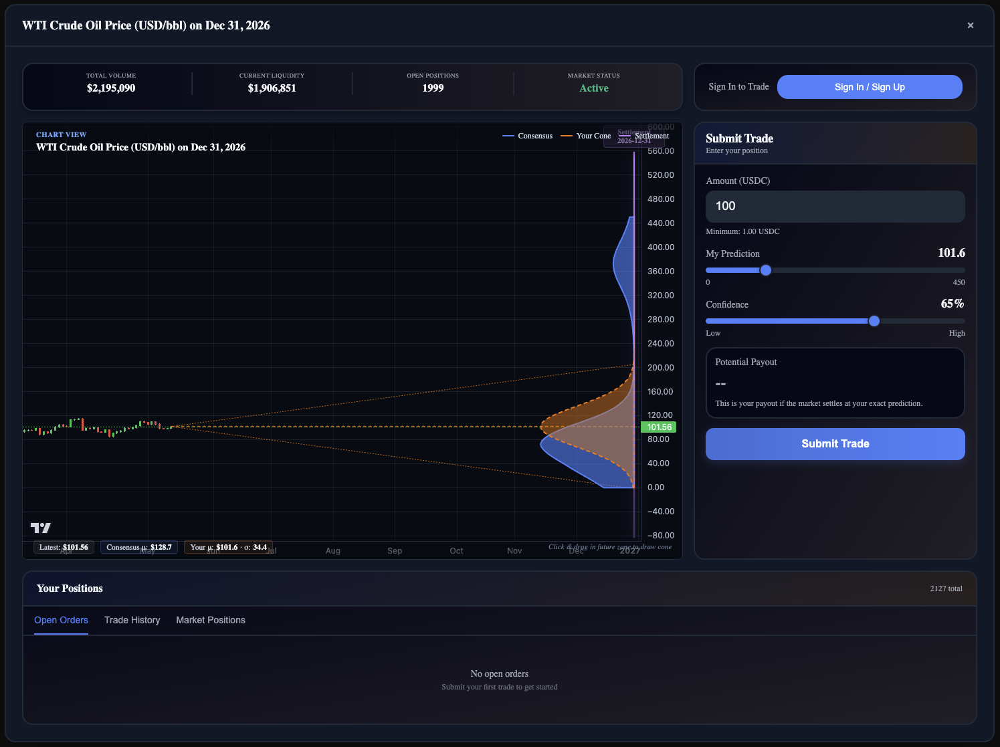
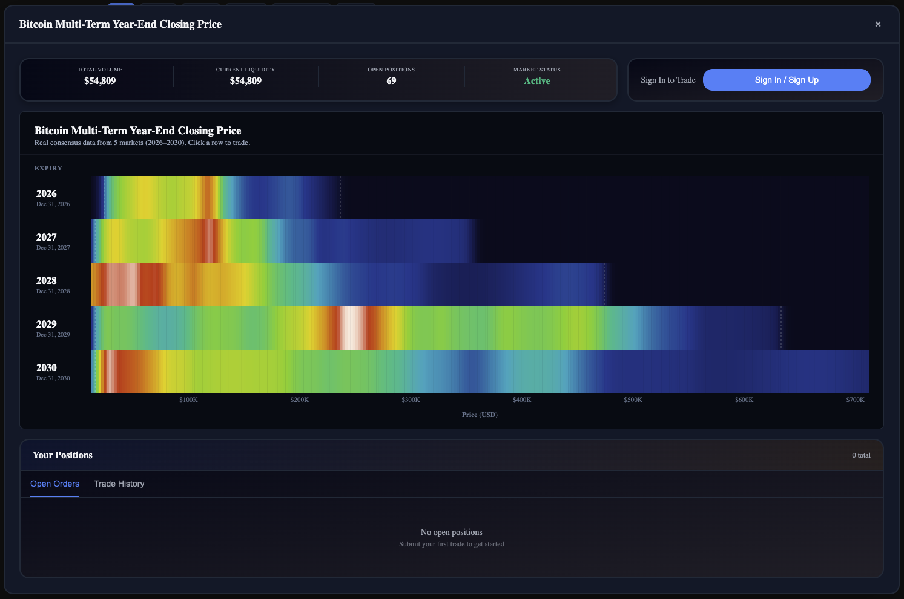
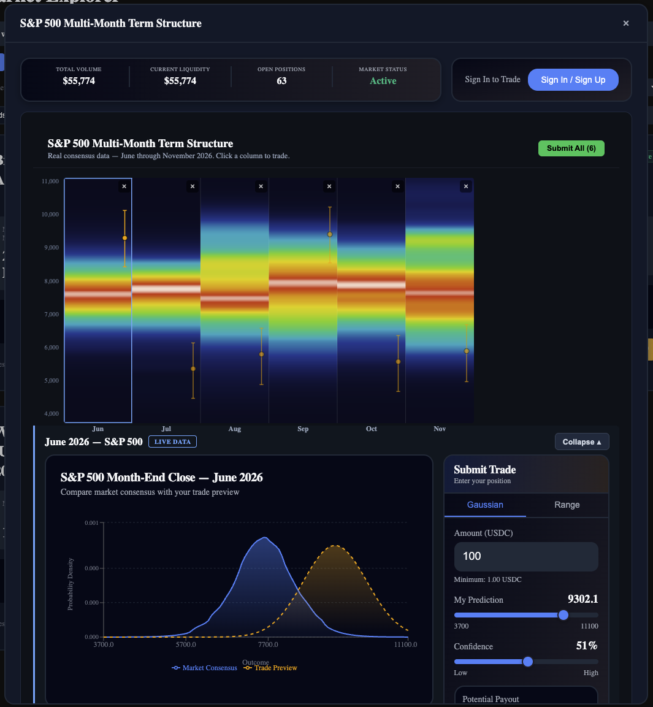
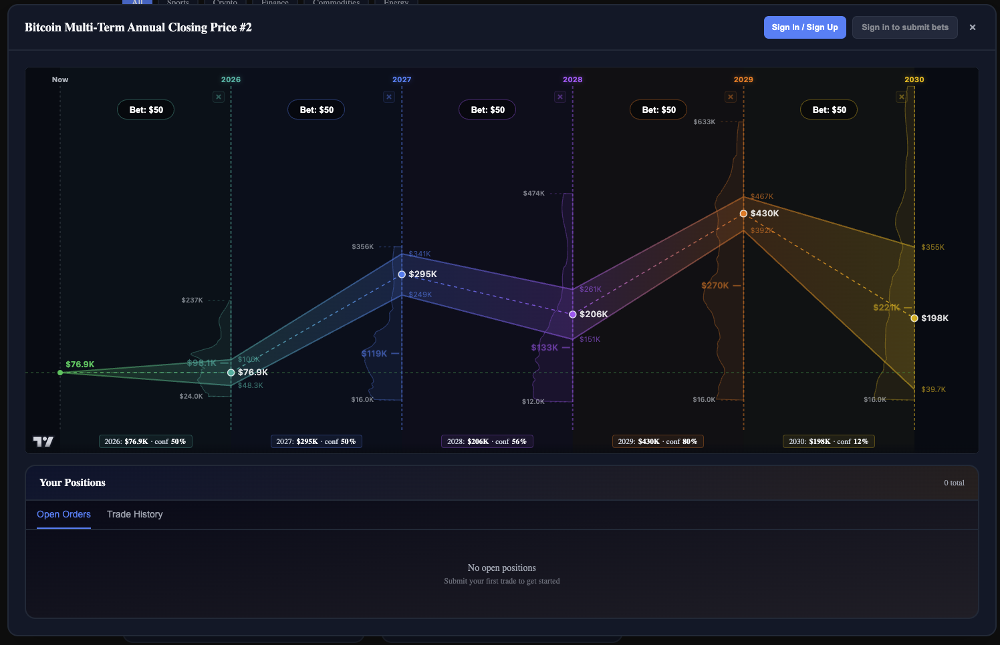
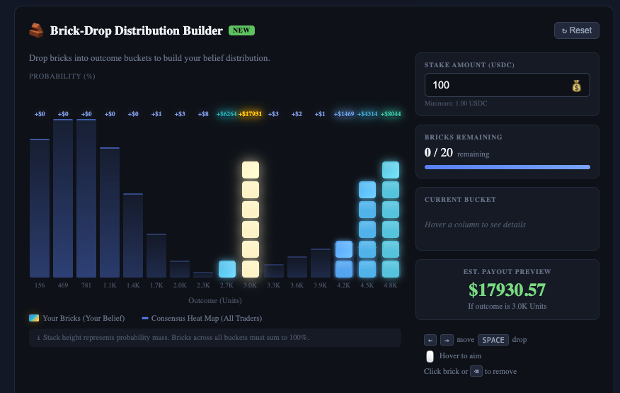

# Submission Description

I have built 4 novel UI components that enable new uses cases for probability distribution bets and a CS2 betting that uses one of the ideas.

The components are:

1. Candlestick Fan chart. It joins a traditional candle chart for past price data (something that users are familiar) with a cone drawing tool that defines a user's belief as a range for possible values of future price. Just just draw what you think will happen with the price and the app turns your drawing into a real bet. This component has been enabled for the "WTI Crude Oil Price (USD/bbl) on Dec 31, 2026" market.



2. Term Structure Heatmap with inline belief painting (vertical and horizontal versions). This component was designed for markets for a price of an asset at different points in time, e.g. BTC price in 2026, 2027, etc. It shows the entire probability distribution for an asset across time with heatmap of price points and allows users to paint a belief curve directly on the chart for any point in time to create a bet. The selected market is "Bitcoin Multi-Term Year-End Closing Price" for horizontal layout, and "S&P 500 Multi-Month Term Structure" for vertical layout. The belief brackets can be dragged and resized to define a probability distribution belief and then multiple bets can be placed with one click. 





3. Term Structure Confidence Band Chart. This component was designed for markets for a price of an asset at different points in time, e.g. S&P 500 price in September 2026, October 2026, etc. Drag your forecast across multiple years at one chart, and the fan around each point shows exactly how certain you are: tight fan means conviction, wide fan means you're uncertain. Place multiple bets directly from the chart. 






4. Block-based (Tetris-style) distribution builder. This is a fun and intuitive way to create a probability distribution belief for the markets where multimodal distributions are possible. Instead of drawing a curve, user builds a probability distribution by stacking blocks that represent probability mass. The more blocks you add to an outcome, the more certain you are in your prediction. For the demo of this component, open "Tesla Optimus Units Sold or Deployed Internally by Dec 2026" market. Colors shown how contrarian your belief is compared to the market consensus.


# FunctionSpace Trading SDK

A TypeScript SDK for embedding prediction market trading widgets into web applications. Developers install the packages via npm and drop in themed, interactive components that handle market visualization, trade input, and position management.

> **Note:** These packages are not yet published to npm. To use the SDK, clone
> this repository and use npm workspace linking. The `npm install` commands in
> the docs are forward-looking and will work once packages are published.

## Documentation

- **Live docs:** [docs.functionspace.dev](https://docs.functionspace.dev)
- **Docs source:** `packages/docs/` (Docusaurus 3 site with live widget demos)
- **AI context files:** `packages/docs/static/` -- `llms.txt`, `core.txt`, `react.txt`, `ui.txt`
- **Internal dev docs:** `internal_sdk_docs/` -- `CLAUDE.md`, `PLAYBOOK.md`, `REACT_ROADMAP.md`

## Architecture

The SDK is split into three layers with strict dependency boundaries. Each layer can be used independently -- consumers pick the level of abstraction they need.

```
packages/
├── core/       @functionspace/core    Pure TypeScript -- API client, math, types
├── react/      @functionspace/react   React integration -- Provider, hooks, context
└── ui/         @functionspace/ui      React components -- charts, trading panels, tables
demo-app/                              Example implementation showing widget usage
```

### Layer Boundaries

| Layer | Can Import | Cannot Import | Purpose |
|-------|-----------|---------------|---------|
| `core` | Nothing (zero dependencies) | `react`, `ui` | API client, belief math, types, queries, transactions |
| `react` | `core` | `ui` | Hooks, context, provider, theme system, state coordination |
| `ui` | `core`, `react` | -- | Pre-built widgets with loading/error states, CSS theming |

These boundaries are enforced by `tests/architecture.test.ts` and will fail CI if violated.

### Data Flow

```
Widget (UI) → Hook (React) → Query/Transaction (Core) → Backend API
                  ↕
            Context (React)    ← coordinates preview state, selection, invalidation
```

- **Server state** flows through hooks: `useMarket`, `useConsensus`, `usePositions`, etc.
- **Preview state** flows through context: `previewBelief`, `previewPayout` (ephemeral, set by trade inputs)
- **Coordination state** flows through context: `selectedPosition` (syncs chart overlays with table selection)
- **Cache invalidation** uses `ctx.invalidate(marketId)` after mutations, which marks that market's cache entries as stale and triggers subscribed hooks to refetch

---

## Packages

### `@functionspace/core`

Pure TypeScript with zero dependencies. Use this layer directly if you don't need React.

**API Client** -- `FSClient` handles authentication (token-based with auto-retry on 401), request building, and guest mode for unauthenticated browsing.

**Math / Position Generation** -- Two-layer architecture for constructing belief vectors:
- **L1**: `generateBelief(regions, numBuckets, lowerBound, upperBound)` -- universal constructor. All belief vectors route through this single normalization path.
- **L2**: Convenience generators -- `generateGaussian`, `generateRange`, `generateDip`, `generateLeftSkew`, `generateRightSkew`. Thin wrappers that construct Region arrays and delegate to L1.

**Density Evaluation** -- `evaluateDensityCurve` (multi-point for charts) and `evaluateDensityPiecewise` (single-point) use quadratic B-spline evaluation over Bernstein coefficient arrays.

**Queries** -- `queryMarketState`, `queryMarketPositions`, `queryTradeHistory`, `queryMarketHistory`, `getConsensusCurve`, `queryDensityAt`.

**Discovery** -- `discoverMarkets` lists available markets, returning an array of `MarketState`.

**Transactions** -- `buy`, `sell`.

**Previews** -- `previewPayoutCurve`, `previewSell` for trade previews without committing.

**Types** -- `MarketState`, `Position`, `FSConfig`, `PayoutCurve`, `BeliefVector`, `TradeEntry`, `MarketHistory`, `FanChartPoint`, and more.

```typescript
import { FSClient, queryMarketState, generateGaussian, buy } from '@functionspace/core';

const client = new FSClient({ baseUrl: 'https://api.example.com', username: 'alice', password: 'secret' });
const market = await queryMarketState(client, 1);
const belief = generateGaussian(50, 5, market.config.numBuckets, market.config.lowerBound, market.config.upperBound);
const result = await buy(client, 1, belief, 100, market.config.numBuckets);
```

### `@functionspace/react`

React integration layer. Provides the `FunctionSpaceProvider`, data-fetching hooks, and the context that coordinates widgets.

**Provider** -- `FunctionSpaceProvider` creates the client, authenticates, sets CSS custom properties for theming, and provides the shared context to all child widgets.

```tsx
import { FunctionSpaceProvider } from '@functionspace/react';

<FunctionSpaceProvider
  config={{ baseUrl: 'https://api.example.com', username: 'alice', password: 'secret' }}
  theme="fs-dark"
>
  {/* All SDK widgets go here */}
</FunctionSpaceProvider>
```

**Hooks** -- Each returns `{ <named>, loading, isFetching, error, refetch }` and uses cache subscription for automatic refetch after mutations.

| Hook | Returns | Use For |
|------|---------|---------|
| `useMarket(marketId)` | `{ market, loading, error, refetch }` | Market metadata, config, state |
| `useConsensus(marketId, points?)` | `{ consensus, loading, error, refetch }` | Probability density curves |
| `usePositions(marketId, username?)` | `{ positions, loading, error, refetch }` | Positions filtered by owner |
| `useTradeHistory(marketId)` | `{ trades, loading, error, refetch }` | Trade log entries |
| `useMarketHistory(marketId, options?)` | `{ history, loading, error, refetch }` | Alpha vector snapshots for timeline charts |
| `useBucketDistribution(...)` | `{ buckets, loading, error, refetch }` | Discrete probability buckets |
| `useDistributionState(config)` | `{ state }` | Managed bucket count + selection state |
| `useAuth()` | `{ user, isAuthenticated, loading, error, login, signup, logout, refreshUser }` | Authentication state and actions |
| `useChartZoom(options)` | `{ containerRef, xDomain, yDomain, isZoomed, isPanning, containerProps, reset }` | Zoom and pan interaction for charts |
| `useCustomShape(market)` | `{ controlValues, pVector, prediction, setControlValue, toggleLock, ... }` | Custom shape editing with draggable control points |
| `useMarkets(options?)` | `{ markets, loading, error, refetch }` | Market discovery with filtering, sorting, limiting |
| `useMarketFilters(config?)` | `{ markets, loading, filterBarProps, ... }` | Search, category, sort state on top of useMarkets |

**Theme System** -- Pass a preset string or a custom color scheme. The provider resolves 30 CSS tokens and chart-specific color values, making them available to all widgets automatically. See [Theming](#theming) for full documentation.

### `@functionspace/ui`

Pre-built React components organized by purpose. Each widget is self-contained -- it checks for `FunctionSpaceProvider`, handles its own loading/error states, and uses hooks internally.

**Charts** (`charts/`)

| Component | Props | Description |
|-----------|-------|-------------|
| `ConsensusChart` | `marketId`, `height?`, `overlayCurves?` | Consensus PDF with optional overlay curves (selected position, preview) |
| `DistributionChart` | `marketId`, `defaultBucketCount?`, `distributionState?` | Discrete probability bar chart with bucket slider |
| `TimelineChart` | `marketId` | Fan chart showing percentile bands over time |
| `MarketCharts` | `marketId`, `views?`, `overlayCurves?`, `defaultBucketCount?` | Tabbed wrapper combining the above charts. `views` controls which tabs appear (e.g., `['consensus', 'distribution', 'timeline']`) |

**Trading** (`trading/`)

| Component | Props | Description |
|-----------|-------|-------------|
| `TradePanel` | `marketId`, `onBuy?` | Gaussian trade input with prediction/confidence sliders |
| `ShapeCutter` | `marketId`, `onBuy?` | Shape-based trade input with multiple belief shapes |
| `BinaryPanel` | `marketId`, `onBuy?` | Simplified yes/no trade input |
| `BucketRangeSelector` | `marketId`, `distributionState` | Range selection on distribution chart |
| `BucketTradePanel` | `marketId`, `onBuy?` | Trade panel for bucket-based trades (creates its own distribution state internally) |
| `CustomShapeEditor` | `marketId`, `onBuy?` | Drag-to-shape belief editor with interactive control points |

**Market** (`market/`)

| Component | Props | Description |
|-----------|-------|-------------|
| `MarketStats` | `marketId` | Read-only statistics bar (mean, median, mode, pool, volume) |
| `PositionTable` | `marketId`, `pageSize?`, `tabs?`, `onSell?` | Tabbed position/trade table with row selection and sell actions |
| `TimeSales` | `marketId` | Real-time trade log |
| `MarketCard` | `market`, `onSelect?` | Summary card for a single market (title, consensus mean, volume, liquidity, traders, status) |
| `MarketCardGrid` | `markets`, `onSelect?`, `loading?` | Responsive grid of MarketCards for market discovery |
| `MarketFilterBar` | `...filterBarProps` | Search, category chips, sort controls -- driven by `useMarketFilters` |
| `MarketExplorer` | `views?`, `children?`, `onSelect?`, `state?`, `showFilterBar?`, ... | Multi-view market discovery with tabbed views (cards, pulse, compact, gauge, split, table, heatmap, charts), filter bar, and optional overlay panel |

**Auth** (`auth/`)

| Component | Props | Description |
|-----------|-------|-------------|
| `AuthWidget` | `requireAccessCode?`, `onLogin?`, `onSignup?`, `onLogout?` | Login/signup/logout UI with form validation |

**Automatic coordination** -- Widgets work together via shared context without any wiring:

```tsx
<FunctionSpaceProvider config={config} theme="fs-dark">
  <MarketCharts marketId={1} views={['consensus', 'distribution']} />
  <PositionTable marketId={1} />
  <TradePanel marketId={1} />
</FunctionSpaceProvider>
```

Click a row in `PositionTable` and its belief curve appears on `ConsensusChart`. Adjust sliders in `TradePanel` and the preview renders on the chart in real time. Submit a trade and all widgets refetch automatically.

---

## Quick Start

```tsx
import { FunctionSpaceProvider } from '@functionspace/react';
import { ConsensusChart, TradePanel, PositionTable } from '@functionspace/ui';

function App() {
  return (
    <FunctionSpaceProvider
      config={{
        baseUrl: import.meta.env.VITE_FS_BASE_URL,
        username: import.meta.env.VITE_FS_USERNAME,
        password: import.meta.env.VITE_FS_PASSWORD,
      }}
      theme="fs-dark"
    >
      <ConsensusChart marketId={1} height={400} />
      <TradePanel marketId={1} />
      <PositionTable marketId={1} />
    </FunctionSpaceProvider>
  );
}
```

### Market Discovery

Browse and select markets, then trade on the selected one:

```tsx
import { FunctionSpaceProvider, useMarkets } from '@functionspace/react';
import { MarketCardGrid, MarketCharts, TradePanel } from '@functionspace/ui';

function App() {
  const [marketId, setMarketId] = useState<number | null>(null);
  // ... see composition guide for full pattern
}
```

Two navigation patterns are available -- state-driven (no router, simpler) and route-driven (React Router, shareable URLs). See the documentation for complete examples and trade-offs.

## Theming

The SDK has a multi-layer theme system. You configure it once on the provider -- all widgets (CSS, charts, tooltips, axes) respond automatically.

### Presets

Four built-in presets cover the most common use cases:

| Preset | Description |
|--------|-------------|
| `"fs-dark"` | FunctionSpace branded dark mode. Blue consensus, amber preview, rounded corners, thick borders. |
| `"fs-light"` | FunctionSpace branded light mode. Same brand colors on white backgrounds. |
| `"native-dark"` | De-branded dark mode. Gray consensus/preview (not blue), tight radii, thin borders, fast transitions. Blends into any host app. |
| `"native-light"` | De-branded light mode. Gray consensus, black preview, minimal styling. |

```tsx
<FunctionSpaceProvider config={config} theme="native-dark">
  {/* All widgets render with native styling */}
</FunctionSpaceProvider>
```

### Custom Color Schemes

You only need to provide the **9 core tokens** -- the remaining 21 optional tokens plus all chart colors are derived automatically:

```tsx
<FunctionSpaceProvider
  config={config}
  theme={{
    primary: '#8B5CF6',       // → consensus line, active elements, focus rings
    accent: '#F59E0B',        // → trade preview line, secondary highlights
    positive: '#10B981',      // → profit states, payout curve, "yes" indicators
    negative: '#EF4444',      // → loss states, sell buttons, "no" indicators
    background: '#0F0F23',    // → widget backgrounds, chart areas
    surface: '#1A1A3E',       // → cards, panels, tooltip backgrounds
    text: '#E2E8F0',          // → primary text, tooltip text
    textSecondary: '#94A3B8', // → axis labels, muted labels, timestamps
    border: '#2D2D5A',        // → dividers, grid lines, tooltip borders
  }}
>
```

**What each core token controls:**

| Token | CSS Elements | Chart Elements |
|-------|-------------|----------------|
| `primary` | Buttons, links, active tabs, focus rings, header gradients | Consensus curve stroke & fill, fan chart mean line & bands |
| `accent` | Preview highlight, secondary badges | Trade preview line stroke & fill |
| `positive` | Profit text, success badges, buy buttons | Payout curve color, first position color |
| `negative` | Loss text, error states, sell buttons | Second position color |
| `background` | Widget backgrounds, gradient bases | Derived: chart background, tooltip bg, grid |
| `surface` | Cards, panels, elevated containers | Tooltip background |
| `text` | Primary text everywhere | Tooltip text |
| `textSecondary` | Labels, timestamps, muted copy | Crosshair/cursor stroke |
| `border` | All borders, dividers, separators | Tooltip border, cartesian grid |

### Extending a Preset

Start from a preset and override specific tokens:

```tsx
// Purple brand on top of FS Dark's layout and optional tokens
<FunctionSpaceProvider
  config={config}
  theme={{
    preset: "fs-dark",
    primary: "#8B5CF6",
    accent: "#A78BFA",
  }}
>
```

The consensus line becomes purple, the preview line becomes light purple, and everything else inherits from `fs-dark`.

### Optional Tokens

If you need finer control, these tokens can be set explicitly. When omitted, they're derived from the core 9:

| Token | Default Derivation | Purpose |
|-------|--------------------|---------|
| `bgSecondary` | `background` | Secondary background (chart areas) |
| `surfaceHover` | `surface` | Hover state for surface elements |
| `borderSubtle` | `border` | Lighter-weight borders, chart grid lines |
| `textMuted` | `textSecondary` | Lowest-contrast text, axis tick labels |
| `navFrom` / `navTo` | `background` | Navigation gradient endpoints |
| `overlay` | `rgba(0,0,0,0.2)` | Overlay backgrounds |
| `inputBg` | `background` | Input field backgrounds |
| `codeBg` | `background` | Code block backgrounds |
| `chartBg` | `background` | Chart area backgrounds |
| `accentGlow` | `rgba(59,130,246,0.25)` | Focus ring glow |
| `badgeBg` / `badgeBorder` / `badgeText` | Derived from grays / `textSecondary` | Badge styling |
| `logoFilter` | `none` | CSS filter for logos |
| `fontFamily` | `inherit` | Global font family |
| `radiusSm` / `radiusMd` / `radiusLg` | `0.375rem` / `0.75rem` / `1rem` | Border radii (smaller = tighter, more "native") |
| `borderWidth` | `1px` | Border thickness (`2px` for FS presets, `1px` for native) |
| `transitionSpeed` | `200ms` | Animation duration (`300ms` for FS, `150ms` for native) |

### Chart Colors

Recharts SVG components require concrete hex values -- CSS variables don't work in `fill`/`stroke` props. The SDK solves this by resolving chart colors from the theme and exposing them on the context as `ctx.chartColors`.

**For preset themes**, chart colors are explicitly defined per preset. FS themes use brand blue for the consensus line; native themes override it to gray for a de-branded look.

**For custom themes**, all chart colors are derived automatically from your core 9 tokens:

| Chart Element | Derived From | Example |
|---------------|-------------|---------|
| Consensus curve | `primary` | Purple primary → purple consensus |
| Trade preview line | `accent` | Amber accent → amber preview |
| Payout curve | `positive` | Green positive → green payout |
| Grid lines | `borderSubtle` (or `border`) | Dark border → dark grid |
| Axis labels | `textMuted` (or `textSecondary`) | Gray text → gray labels |
| Tooltip background | `surface` | Dark surface → dark tooltip |
| Tooltip border | `border` | -- |
| Tooltip text | `text` | -- |
| Crosshair/cursor | `textSecondary` | -- |
| Fan chart bands | Opacity variants of consensus color | Purple consensus → purple bands at 58%/40%/28%/20% opacity |

You never need to specify chart colors directly -- they follow your theme tokens. If a preset overrides them (like native's gray consensus), that takes precedence over the derivation.

## Development

### Demo App

```bash
cd demo-app && npx vite dev
```

### Tests

```bash
npx vitest run
```

| Test File | Covers |
|-----------|--------|
| `tests/architecture.test.ts` | Layer boundaries, hook patterns, export completeness, context shape |
| `tests/hooks.test.tsx` | Hook behavior (loading, error, refetch, context) |
| `tests/themes.test.ts` | Theme presets, resolveTheme, resolveChartColors, chart color derivation |
| `tests/shapes.test.ts` | Belief shape validation (vector properties, shape characteristics) |
| `tests/binary.test.ts` | Binary panel-specific tests |
| `tests/client-auth.test.ts` | Client auth, core math functions (position generators, density evaluation) |
| `tests/api-integration.test.ts` | API / transaction functions |
| `tests/mappings.test.ts` | Mocked-fetch mapping contract tests (raw API shape to SDK type, POST body assertions) |
| `tests/validation.test.ts` | Belief vector validation (validateBeliefVector) |
| `tests/chart-zoom.test.ts` | Chart zoom/pan utilities (domain computation, pixel mapping, data filtering) |
| `tests/cache.test.ts` | QueryCache class unit tests (deduplication, staleness, revalidation) |
| `tests/client-signal.test.ts` | FSClient signal forwarding and request cancellation |
| `tests/components.test.tsx` | Widget smoke tests (provider guard, loading, error, primary action, cleanup) |

### Build Verification

```bash
cd demo-app && npx vite build
cd packages/docs && npx docusaurus build
```

(The Docusaurus build verifies no broken links in documentation.)

## Project Structure

```
packages/
├── core/src/
│   ├── index.ts              All exports
│   ├── types.ts              Type definitions
│   ├── client.ts             FSClient (auth, requests)
│   ├── math/generators.ts    Belief vector construction (L1/L2)
│   ├── math/density.ts       Density evaluation, statistics
│   ├── math/fanChart.ts      History -> fan chart transform
│   ├── queries/              Read operations (market, positions, history)
│   ├── transactions/         Write operations (buy, sell)
│   ├── previews/             Preview operations (payout curve, sell estimate)
│   ├── shapes/               Shape definitions for trade inputs
│   ├── discovery/            Market listing
│   ├── auth/                 Authentication (login, signup, user fetching)
│   └── chart/                Chart interaction utilities (zoom, pan)
├── react/src/
│   ├── index.ts              All exports
│   ├── context.ts            FSContext interface (includes chartColors)
│   ├── themes.ts             Theme types, 4 presets, ChartColors, resolveChartColors
│   ├── FunctionSpaceProvider.tsx  Provider, theme + chart color resolution
│   ├── use*.ts               Data-fetching hooks
│   └── rechartsHelpers.ts    Recharts integration utilities
└── ui/src/
    ├── index.ts              Re-exports all components
    ├── theme.ts              Deprecated static chart colors (use ctx.chartColors)
    ├── styles/base.css        All widget styles (CSS variables only)
    ├── charts/               ConsensusChart, DistributionChart, TimelineChart, MarketCharts
    ├── trading/              TradePanel, ShapeCutter, BinaryPanel, BucketRangeSelector, BucketTradePanel, CustomShapeEditor
    ├── market/               MarketStats, MarketCardGrid, MarketExplorer, MarketFilterBar, PositionTable, TimeSales
    └── auth/                 AuthWidget
```

## Deploying `demo-app` To Vercel Free

The demo app is a Vite app inside this monorepo. Use the competition dev API endpoint as the only required environment variable.

### 1. Push The Repo To GitHub

Make sure your latest committed changes are pushed to GitHub:

```bash
git push origin main
```

### 2. Create A Vercel Project

1. Go to [vercel.com/new](https://vercel.com/new).
2. Import this GitHub repository.
3. Select the Free/Hobby plan.
4. In **Configure Project**, set:

| Setting | Value |
|---------|-------|
| Framework Preset | Vite |
| Root Directory | `demo-app` |
| Build Command | `npm run build` |
| Output Directory | `dist` |
| Install Command | `cd .. && npm install` |

The custom install command is important because `demo-app` depends on the local workspace packages in `packages/*`.

### 3. Add Environment Variable

In Vercel project settings, add:

```bash
VITE_FS_BASE_URL=https://fs-engine-api-dev.onrender.com
```

Use this exact URL. The competition dev endpoint has CORS enabled for public deployments.

### 4. Deploy

Click **Deploy**. After the build finishes, open the generated Vercel URL and verify:

1. The Market Explorer loads.
2. Passwordless sign-in works.
3. You can place a small test trade and see it appear in positions.
